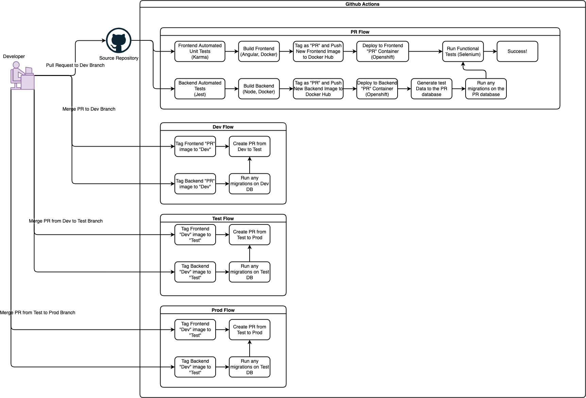

# srs-technical-assignment
This project contains a running example of the "CI" portion of the pipeline depicted in the diagram below using github actions. Also included in this repo is an angular front end application, and dockerfile for demonstration purposes. It also contains a SRE Implementation Strategy in section 2 of this document.

## 1. Pipeline Diagram

## 2. SRE Implementation Strategy

The following will outline recommendations to improve site reliability through monitoring and acting upon health and performance metrics. Outlining what metrics are important and what technologies that can be used to collect and monitor them. Finally Service Level Objectives (SLO) will be discussed outlining what actions should be taken in response to the information and metrics collected, which of these responses can be automated, and which will be the most painful to deal with.
### 2.1 Metrics and Monitoring

When managing container based applications on a platform such as Openshift, DevOps specialists are responsible for correct configurations and monitoring to ensure highly available, resilient applications. There are several metrics and tools, as well as design decisions to consider when developing and maintaining these applications.

#### 2.1.1 Uptime Monitoring

Probably the most important thing to monitor is simply weather a user can access your application. An automated health check can be performed by trying to access your site and retrieving some piece of data from it. If this should fail there is a high chance that your users will experience the same failure and the team should be receiving alerts as soon as possible.

Products like Uptime Robot can be used for this, but if the intention is to do more intense monitoring, then building an uptime check into a product like Splunk, Prometheus, or Grafana may the way to go. Preference may go towards Prometheus as it is open source like most bcgov applications.

#### 2.1.2 Latency

Latency is the time it takes to receive a request, and should be monitored to ensure users are having a fluid experience on the application. High latency could mean that you may have to adjust memory/ cpu limits, or autoscaling triggers. The team should be alerted when latency passes a certain percentile threshold.

#### 2.1.3 Container Health

When assessing a containers health we need to know weather we are getting any error states or hitting any memory and CPU limits or thresholds. Alerts should be thrown if we are experiencing errors or hitting limits. Autoscaling should be configured to provide high availability for when containers become overloaded. Prometheus is a candidate for container health monitoring and alerting.

#### 2.1.4 Traffic Volume Changes

If the application is receiving a sharp increase in traffic volume, then the team should be alerted as action may be required to assist in scaling. Again Prometheus could be used for monitoring traffic fluctuations and throwing alerts.

#### 2.1.5 Highly Available Data

Having highly available data means having multiple running copies of the same DB in case of a failure in one. Replica sets can implemented to accommodate these types of failures. Data loss can occur from use error or malicious attack as well, and be propagated through all replicas. Automated periodic backups should be implemented to prevent this type of mass data loss.

#### 2.1.6 Threat Detection

Security scanning tools such as Sysdig can be used to detect security threats and incidents. Sysdig is open source and compatible with Prometheus, so if Prometheus is chosen it would make sense to use Sysdig as well.

#### 2.1.7 Certificate Renewal

This is worth mentioning as it can be easy to overlook when you are dealing with highly complex systems and have many other operational tasks to think about. Having a simple reminder that your certificates will expire well in advance can give you time to prepare and put time aside to renew them. Automating parts of this process is ideal as this task will most definitely need to be repeated.
### 2.2 Service Level Objectives (SLO)/ Remediation Actions

TODO: Service Level Objectives (SLO)
  - active production environment with high user load and low tolerance for downtime
  - prioritized reliability work
  - what can be automated?
  - highlight pain points
  - change management(?)

here's the prioritized list of reliability stuff to do, what can be automated, what can't be automated, and what's gonna suck the most.

Incidents are bound to occur, so it is important that we predict them, and are prepared to respond to them immediately to mitigate downtime. Detailed runbooks should be created for each of the events described above, and automating when possible.

#### 2.2.1 Container Configuration
This is important to handle user load efficiently. Using the metrics provided by the data collection tools described above we can adjust our configs to accurately fit user needs. This can mean adjusting cpu/ memory limits as well as setting up automated autoscaling rules to adjust for fluctuating loads.

#### 2.2.2 Automated Backups
One of the most important and easiest things to do is to setup some automated database backups to run on a chron schedule. There are many tools available to do this for different types of databases, but it is important that this is done early to keep a record of the data history. It can mean countless hours of staff's time lost as well as result in an irrecoverable state if data loss occurs.

#### 2.2.3 Automated Alerting
Based on the metrics described above, some form of alerting should be developed to ping developers when an issue occurs. Teams integration or a Rocket Chat webhook is desireable as well as an email for higher priority issues. Many of the issues described in section 2.1 will require manual intervention and may simply mean a configuration refinement. Alerts should be set up for: uptime, latency, container health, abnormal traffic volume changes, potential security threats, and certificate renewal.

#### 2.2.4 Database Recovery
This may be a pain point depending on how severe the data loss is. It is important to cover many types of data loss and have a plan for each of them. Data loss has potential for large amounts of downtime if preparations are not properly taken. A database backup recovery plan can largely be automated to reduce downtime. In the case of a database pod entering an unhealthy state, if we're using replica sets we can simply switch over to one of the secondary databases while the other one recovers. In the case of data loss requiring a backup be restored, considering a hot standby database with latest backup running may be an option to reduce downtime.

#### 2.2.5 Security Breach Response
Should a security breach occur, the team should be ready to respond on a technical level as well as have a plan to communicate to their users and stakeholders. Security breaches in the public sector are taken seriously and the team should know what to do before it happens. Information can be found about how to handle security events on the BC Governments website.

#### 2.2.6 Certificate Renewal Runbook/ Automation
Automating the Certificate renewal process can make the work flow easier and less obtrusive for developers to context switch. This is a task that requires developer intervention with long periods in between and is important to get right. Automation reduces developer time and mistakes.